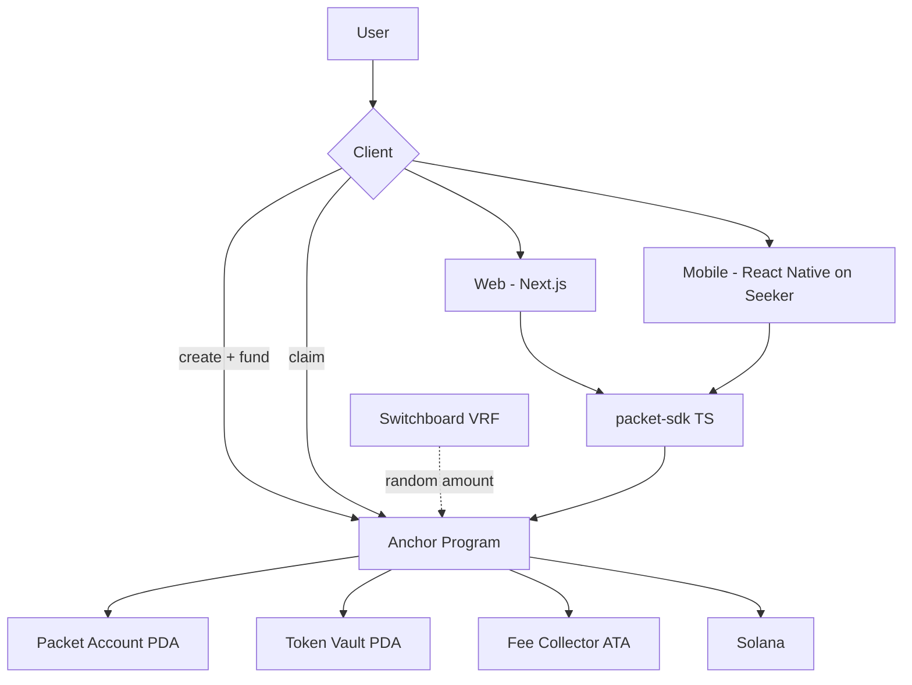

# PACKET 🧧 — Build Plan (Anchor-first)

**Status:** Draft plan
**Scope:** Anchor program + Web app + Seeker mobile app
**Later:** Rebuild program on Aegis 🔱 (dogfooding)

---

# 1. Guiding Decisions

| Decision | Choice | Why |
|---|---|---|
| Program framework (now) | **Anchor** | Fastest path to a working, tested program. Aegis comes later as a rewrite (dogfooding). |
| Program framework (later) | **Aegis** | Packet is Aegis's first serious test. Anchor IDL compatibility makes migration tractable. |
| Web app | **Vite + React + Tailwind + framer-motion** | Light client-side dApp; simpler than Next.js. OG previews + Blinks handled by a tiny API server. |
| Mobile app | **React Native (Expo dev client) + Solana Mobile SDK** | Seeker runs Android; Mobile Wallet Adapter + Seed Vault is the native wallet story. |
| Tokens | **USDC first** | Spec says one stablecoin for MVP. |
| Networks | devnet → mainnet-beta | Test with free money first. |
| Randomness (MVP) | Equal first, then **Switchboard VRF** for Random | Spec explicitly forbids insecure pseudo-randomness for production. |
| Shareable identity | **Packet PDA address** as the URL slug | `packet.app/p/<pubkey>` — no extra naming system needed. |

---

# 2. System Architecture



Two clients, one shared TypeScript SDK, one Anchor program. Later, the Anchor program is swapped for the Aegis-generated one behind the same SDK interface.

---

# 3. Monorepo Layout

```text
packets/
├── PLAN.md               ← this file
├── program/              # Anchor program (Solana)
│   ├── programs/packet/
│   └── tests/
├── sdk/                  # Shared TS package (web + mobile)
│   └── src/              # IDL types, createPacket, claimPacket, links
├── web/                  # Vite + React app
├── api/                  # Hono server: OG link previews + Blinks endpoints
└── mobile/               # React Native app for Seeker
```

The `sdk/` package is pure TypeScript: both apps import it, so PDA derivation, tx building and share-link logic live in exactly one place.

---

# 4. Anchor Program Design

## 4.1 Accounts

### Packet (PDA)
```rust
#[account]
pub struct Packet {
    pub creator: Pubkey,
    pub mint: Pubkey,
    pub total_amount: u64,
    pub remaining_amount: u64,
    pub per_claim_amount: u64,      // Equal mode
    pub recipient_limit: u32,
    pub claim_count: u32,
    pub mode: DistributionMode,     // Equal | Random
    pub expires_at: i64,            // unix seconds, 0 = never
    pub status: PacketStatus,       // Active | Completed | Closed
    pub vault: Pubkey,
    pub bump: u8,
}
```

PDA seeds: `["packet", creator, nonce]` where `nonce` is random bytes generated client-side. The derived address becomes the public Packet ID — unguessable and short enough for links.

### Vault (Token account PDA)
- Seeds: `["vault", packet]`
- Holds the SPL tokens until claims or refund.
- No close authority; only the program can move funds out.

### Fee Collection + Config
- Global `Config` account: fee in basis points, fee collector, admin.
- `create_and_fund` routes the fee portion directly to the fee collector's ATA at fund time — no fee vault PDA (removes the pre-creation DoS on a fixed-PDA vault).

## 4.2 Instructions

| Instruction | Caller | Does |
|---|---|---|
| `create_packet` | creator | Allocate Packet + Vault, set config (amount, limit, mode, expiry) |
| `fund_packet` | creator | Transfer tokens creator ATA → vault, take fee, set status Active. (Can be merged into one `create_and_fund` for UX.) |
| `claim_packet` | any user | Validate → compute amount → transfer vault → claimer ATA → update counters |
| `refund_packet` | creator | After expiry/completion: withdraw unclaimed remainder + close accounts |
| `settle_random_claim` | VRF oracle | Callback that finalizes a pending Random claim |

## 4.3 Claim validation (must ALL pass)

1. Status == Active
2. Not expired (`expires_at`)
3. `claim_count < recipient_limit`
4. Not already claimed (per-user claim record)
5. Vault has enough for the computed amount
6. Computed amount never exceeds `remaining_amount`

Per-user double-claim prevention: a small `claims: Vec<Claim>` in the Packet account, pre-allocated for `recipient_limit` (bounded — fine for MVP sizes), plus an Anchor event per claim for history/indexing.

## 4.4 Core invariant (from the spec)

> **Total distributed ≤ total funded. Every path that moves money out of the vault must reduce `remaining_amount` by exactly the same amount, checked + updated in the same instruction.**

---

# 5. Distribution Math

## Equal
- `per_claim = total / limit`
- Remainder (`total % limit`) goes to the final claimant — no dust left behind.

## Random — the hard part
On-chain randomness must not come from `Clock`/slothash tricks. Two real options:

| Option | How | Trade-off |
|---|---|---|
| **Switchboard VRF** (chosen) | `claim` requests randomness → oracle settles via callback | ~2 txs + a few seconds of "opening…" suspense (actually great UX) |
| Merkle-commit | Creator pre-generates shares (stick-breaking: N-1 random cut points, sorted, shares = gaps — always sums exactly to total), commits root | Cheapest, but shares are fixed at creation → a sniper could race for the biggest share |

Plan: **Equal ships first. Random ships on VRF.** The "opening…" delay doubles as anticipation, which fits the product.

---

# 6. Fee Mechanism (MVP)

- 1% platform fee, **added on top** at fund time: creator funds `$100 + $1 fee`, recipients split the full `$100`. Transferred directly to the fee collector's ATA (configurable via Config account).
- Shown transparently in the create flow: `$100 packet + $1 fee = $101 total`.
- Unclaimed remainder on expiry → refundable to creator (fee is not refunded).
- Invariant: what you drop is what they get — the fee never reduces the packet amount.

## 6b. Storage — what's on-chain vs a database

**MVP: no database.** Everything critical is on-chain; everything else is derived or cached.

| Data | Where | Notes |
|---|---|---|
| Packet state, claims, vault funds | On-chain accounts | Source of truth |
| Double-claim prevention | On-chain program logic | `claims: Vec<Pubkey>` check + push in the same instruction (atomic). Later: claim-ticket PDA per (packet, claimer) for large limits |
| Fee config | On-chain Config account | |
| Blink/OG endpoints | Stateless — read on-chain | |
| Token registry | Static JSON in SDK | |
| User history (MVP) | localStorage + Helius tx scan | No own infra |
| Feeds/profiles/leaderboards (Phase 2+) | Indexer + Postgres/Supabase via Helius webhooks | UX speed layer only — never security |

Rule: **the database can be wrong and the product survives. The program can't be.**

---

# 7. Shareable Links & Deep Links

- Packet ID = Packet PDA address: `https://packet.app/p/7x92...`
- The page fetches the account and renders the envelope — **no backend needed**.
- Mobile: same URL opens the Seeker app via app-links (Android). Fallback: `packet://p/<address>`.
- QR codes encode the same URL → event packets = scan → open → claim.

---

# 8. Web App

**Stack:** Vite + React (TypeScript), react-router, Tailwind, framer-motion, `@solana/wallet-adapter`, shared `sdk/`.

**Routes:**
| Route | Screen |
|---|---|
| `/` | Home: **personal view only** — your packets + your claims + Drop CTA (no public feed in MVP) |
| `/create` | Stepper: Amount → Recipients → Mode → Expiry → Review → Drop |
| `/p/:address` | Packet claim page (envelope) |
| `/history` | Created / claimed lists |

**Companion API server (`api/`, Hono):**
- OG meta tags for `/p/:address` so shared links show a nice 🧧 preview card in WhatsApp/Telegram/X
- Solana Actions endpoints (claim, drop, status, refund) — see `BLINKS-ACTIONS.md`
- Deployment: static web (Cloudflare Pages/Vercel) + API as one worker

**Key moments:**
- Create: one tx (`create_and_fund`) — feels instant
- Share sheet: copy link, QR, WhatsApp/Telegram/X (native `navigator.share` on mobile)
- Claim: envelope opening animation → count-up amount → confetti → "Drop your own" CTA

---

# 9. Seeker Mobile App

**Stack:** React Native (Expo dev client), `@solana-mobile/mobile-wallet-adapter-protocol` (Seed Vault wallets), reanimated for the reveal, `react-native-vision-camera` for QR, shared `sdk/`.

**Screens:**
| Screen | Notes |
|---|---|
| Home | Live packets + big Drop CTA |
| Create | Same stepper as web, native wallet via MWA |
| Packet | Envelope reveal, share sheet |
| Scan | Camera QR → opens packet |
| History | Created / claimed |

**Seeker specifics:**
- Wallet connection via **Mobile Wallet Adapter** (no browser extension needed)
- **App Links** so `packet.app/p/...` opens straight into the app
- Push/QR-first flows for event use cases (conferences, meetups)

---

# 10. UI Concept

Brand direction: **red envelope 🧧** — warm red + gold accents, cream background, playful, rounded, celebratory. It must NOT look like a crypto dashboard: no hashes, no jargon, envelope first.

## Home (mobile-first)
```text
┌─────────────────────────┐
│  PACKET 🧧              │
│  Money worth opening    │
│                         │
│  ╔═══════════════════╗  │
│  ║  🧧  $100          ║ │
│  ║  7/10 claimed      ║ │
│  ║  Random · 59m left ║ │
│  ║      [Open]        ║ │
│  ╚═══════════════════╝  │
│                         │
│  ╔═══════════════════╗  │
│  ║  🧧  $50           ║ │
│  ║  3/20 claimed      ║ │
│  ║  Equal · 1h left   ║ │
│  ║      [Open]        ║ │
│  ╚═══════════════════╝  │
│                         │
│  [ + Drop a Packet ]    │
└─────────────────────────┘
```

## Create flow
```text
$100  →  10 people  →  Equal / Random  →  1 hour  →  Review & Drop
```

## Claim page
```text
┌─────────────────────────┐
│        🧧               │
│     $100 PACKET         │
│   7 of 10 claimed       │
│  Random · 59 min left   │
│                         │
│   [ OPEN PACKET ]       │
└─────────────────────────┘
           ↓
     flap opens, card slides out
           ↓
     ✨ confetti ✨
     You got $12.40!
     [Share] [Drop your own]
```

Animation story per screen:
- Envelope: flap rotates open, inner card slides up, count-up number, confetti burst
- VRF delay shows "Opening your packet…" (builds anticipation)
- Completed packet: shows winners list + remaining time

---

# 11. Build Milestones

| Phase | Deliverable |
|---|---|
| **0** | Scaffold Anchor program + tests on devnet |
| **1** | Equal distribution end-to-end on-chain (create, fund, claim, refund) + full program test suite |
| **2** | Web MVP: create → drop → share → claim (Equal only) |
| **3** | Random via Switchboard VRF on-chain + in clients |
| **4** | Seeker mobile app: home, create, claim, scan, history |
| **5** | Polish: animations, share sheet, QR events, fee tuning |
| **6+** | Aegis rewrite of the program (dogfooding), SDK stays stable |

---

# 12. Aegis Migration Path (dogfooding)

Per the spec's Dogfooding Rule: whenever Packet hits a recurring problem (state, payments, concurrency, randomness, security), solve it in Aegis first, then rebuild Packet on the improved Aegis.

Concretely:
1. Ship Anchor MVP → real users, real feedback.
2. Log every painful/repetitive pattern in the program (validation, PDA plumbing, token transfer boilerplate).
3. Feed those into Aegis V0 components (`aegis::vault`, `aegis::rewards`, `aegis::tokens`).
4. Rebuild `program/` on Aegis behind the same SDK interface.
5. Benchmark Anchor vs Aegis on the Packet codebase (the spec's own success test).

---

# 13. Open Questions

- [ ] Stablecoin choice: USDC only for MVP?
- [ ] VRF provider: Switchboard vs ORAO (need to compare cost/latency)
- [ ] Fee: 1% flat — confirm, or test other rates?
- [ ] `create_and_fund` as one tx — worth the extra program logic for UX?
- [ ] Claim records on-chain (for winner lists) vs events + indexer?
